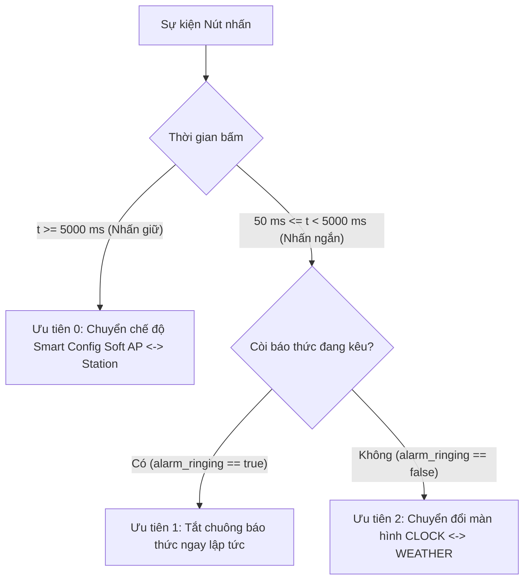

# SMART WEATHER ALARM CLOCK — Project 2 (Embedded Linux)

> **Học viên:** Lê Phúc Tài  
> **Lớp:** DevLinux Embedded Linux K26.1  
> **Phần cứng mục tiêu:** Raspberry Pi Zero W / Zero 2W (BCM2835 / BCM2710)  
> **Hệ điều hành:** Yocto Linux (Poky Minimal Kernel 5.15 / 6.1) / Ubuntu 22.04 LTS  

---

## 1. Giới thiệu Dự án

**Smart Weather Alarm Clock** là sản phẩm nhúng hoàn chỉnh kết hợp giữa Lập trình Driver Nhân Linux (Kernel-space) và Ứng dụng Đa luồng (User-space Systems Programming):
* **Driver Nút nhấn Đa chức năng (`/dev/btn_driver`):** Bắt ngắt 2 cạnh (`IRQ_TYPE_EDGE_BOTH`), lọc rung phím 20ms trong kernel và ghi nhận timestamp nanosecond bằng `ktime_get_ns()`.
* **Driver Còi Buzzer (`/dev/buzzer_driver`):** Sử dụng `hrtimer` trong nhân Linux để xuất xung vuông chính xác tần số 2000 Hz điều khiển còi báo thức.
* **Màn hình OLED SSD1306 (128x64):** Giao tiếp I2C trực tiếp qua `/dev/i2c-1` (địa chỉ `0x3C`), hỗ trợ 2 màn hình (Đồng hồ & Thời tiết).
* **Mạng Wi-Fi & Smart Config:** Tự động chuyển đổi giữa **Soft AP** (`wpa_supplicant` mode=2 + `udhcpd`) và **Station** (`wpa_supplicant` + `udhcpc`), có cơ chế timeout 20s tự khôi phục Soft AP khi sai mật khẩu.
* **Đồng bộ Thời gian & Báo thức:** Client SNTP UDP thuần đồng bộ giờ chuẩn UTC+7; lưu cấu hình báo thức bằng kỹ thuật **Atomic Write** (`.tmp` $\rightarrow$ `fsync` $\rightarrow$ `rename`).
* **Webserver Cấu hình Nhúng:** Socket C thuần (port 8080) phục vụ giao diện Web cấu hình Wi-Fi và đặt giờ báo thức.

---

## 2. Sơ đồ Nối chân Phần cứng (Hardware Pinout)

| Thiết bị Ngoại vi | Chân SoC (BCM) | Chân Header (Physical Pin) | Chế độ Hoạt động / Giao thức |
|---|---|---|---|
| **Nút nhấn (Button)** | `GPIO 17` | Pin 11 | Input, Active-Low, Internal Pull-Up, Dual-Edge IRQ |
| **Còi Buzzer** | `GPIO 27` | Pin 13 | Output, Active-High, PWM/hrtimer 2000 Hz |
| **OLED SSD1306 SDA** | `GPIO 2` | Pin 3 | I2C-1 Data (`/dev/i2c-1`, Address `0x3C`) |
| **OLED SSD1306 SCL** | `GPIO 3` | Pin 5 | I2C-1 Clock (`/dev/i2c-1`, Address `0x3C`) |
| **Nguồn VCC / GND** | `3.3V / GND` | Pin 1 / Pin 6, 9 | Cấp nguồn cho OLED, Nút nhấn, Buzzer |

---

## 3. Cấu trúc Thư mục Bàn giao Chuẩn

```text
submission/
├── AGENTS.md                          # Tài liệu cấu hình hệ thống & quy chuẩn lập trình
├── DESIGN.md                          # Bản thiết kế kiến trúc hệ thống (Software Design Document)
├── README.md                          # Hướng dẫn tổng quan, sơ đồ nối chân, build & run
├── devicetree/
│   ├── smartclock-overlay.dts         # Source Device Tree Overlay (GPIO 17, 27, I2C1)
│   └── smartclock-overlay.dtbo        # Binary Device Tree Blob đã biên dịch
├── docs/
│   ├── test_report.md                 # Báo cáo kết quả 11 Test Cases & Bằng chứng Debug
│   ├── debug_logs/
│   │   ├── helgrind.log               # Log phân tích đa luồng Helgrind (0 errors)
│   │   ├── valgrind.log               # Log phân tích bộ nhớ Valgrind Memcheck (0 leaks)
│   │   ├── strace.log                 # Log theo dõi syscalls (timerfd, socket, poll)
│   │   └── gdb.log                    # Log kiểm thử GDB backtrace 6 worker threads
│   └── demo/
│       └── demo_links.txt             # Đường dẫn video demo minh chứng cho Mentor
├── include/
│   └── smartclock_common.h            # Header dùng chung Kernel & Userspace
├── src/
│   ├── Makefile                       # Top-level Makefile quản lý build toàn bộ dự án
│   ├── driver/
│   │   ├── Makefile                   # Kbuild Makefile cho Kernel Modules
│   │   ├── btn_driver.c               # Character Driver nút nhấn GPIO ngắt 2 cạnh
│   │   └── buzzer_driver.c            # Character Driver còi buzzer hrtimer 2 kHz
│   └── app/
│       ├── Makefile                   # Makefile biên dịch ứng dụng Userspace
│       ├── main.c                     # Luồng chính, quản lý vòng đời và bắt signal
│       ├── system_state.h             # Cấu trúc Shared State & Mutex boundary
│       ├── clock_screen.c/.h          # Màn hình đồng hồ (timerfd 1s + time(NULL))
│       ├── weather_screen.c/.h        # Màn hình thời tiết (Socket Non-blocking 5s)
│       ├── alarm_manager.c/.h         # So giờ báo thức, kích còi, Atomic Write config
│       ├── smartconfig.c/.h           # Quản lý mạng Soft AP <-> Station, SNTP client
│       ├── webserver.c/.h             # Socket HTTP server thuần (Port 8080)
│       └── ssd1306_oled.c/.h          # Thư viện đồ hoạ I2C OLED SSD1306
└── systemd/
    └── smartclock.service             # Systemd Unit File tự khởi động cùng hệ thống
```

---

## 4. Ma trận Xử lý Nút nhấn theo Ngữ cảnh (Button Priority Matrix)

Nút nhấn vật lý (GPIO 17) được quản lý tập trung và phân loại sự kiện nguyên tử dưới một Lock Mutex duy nhất (`g_state_mutex`):



| Mức Ưu tiên | Ngữ cảnh Hệ thống | Hành động Nhấn | Kết quả Xử lý |
|---|---|---|---|
| **Ưu tiên 0** *(Ngắt ngầm)* | Bất kỳ lúc nào (Chuông kêu hoặc không) | Nhấn giữ $\ge 5\text{s}$ | Chuyển đổi qua lại giữa **Soft AP** và **Station**. Nếu còi đang kêu, tự động tắt còi trước khi chuyển mạng. |
| **Ưu tiên 1** *(Cao nhất khi reo)* | Còi báo thức đang kêu (`alarm_ringing == true`) | Nhấn ngắn ($< 5\text{s}$) | **Tắt còi báo thức ngay lập tức** (`alarm_ringing = false`). Giữ nguyên màn hình hiện tại. Lần nhấn tiếp theo quay về luồng thường. |
| **Ưu tiên 2** *(Bình thường)* | Còi không kêu (`alarm_ringing == false`) | Nhấn ngắn ($< 5\text{s}$) | **Chuyển đổi màn hình** hiển thị trên OLED (`CLOCK` $\leftrightarrow$ `WEATHER`). |

---

## 5. Hướng dẫn Biên dịch & Chạy Ứng dụng

### 5.1 Biên dịch toàn bộ Dự án
```bash
cd src/
make clean
make all      # Biên dịch cả Kernel Drivers và Userspace Application
```

### 5.2 Nạp Device Tree & Drivers trên Raspberry Pi
```bash
# 1. Nạp Device Tree Overlay
sudo dtoverlay devicetree/smartclock-overlay.dtbo

# 2. Nạp 2 Character Device Drivers
sudo insmod src/driver/btn_driver.ko
sudo insmod src/driver/buzzer_driver.ko

# 3. Phân quyền truy cập các Device Nodes
sudo chmod 666 /dev/btn_driver /dev/buzzer_driver /dev/i2c-1

# 4. Tạo thư mục cấu hình hệ thống
sudo mkdir -p /etc/smartclock /etc/wpa_supplicant /var/lib/misc
```

### 5.3 Chạy Ứng dụng
* **Chạy trực tiếp từ Terminal:**
  ```bash
  sudo ./src/app/smartclock
  ```
* **Chạy dưới dạng Dịch vụ Systemd (Tự khởi động cùng OS):**
  ```bash
  sudo cp systemd/smartclock.service /etc/systemd/system/
  sudo cp src/app/smartclock /usr/bin/
  sudo systemctl daemon-reload
  sudo systemctl enable smartclock.service
  sudo systemctl start smartclock.service
  ```

---

## 6. Bảng Đối chiếu Yêu cầu Đề bài (Requirement Coverage)

| ID Yêu cầu | Mô tả Chức năng | File Source Code thực thi | Trạng thái |
|---|---|---|---|
| `P2-M1` | Driver nút nhấn GPIO ngắt + Chuyển đổi Soft AP $\leftrightarrow$ Station | `src/driver/btn_driver.c`<br>`src/app/smartconfig.c` | **Hoàn thành (PASS)** |
| `P2-M2` | Driver buzzer PWM/hrtimer 2000 Hz | `src/driver/buzzer_driver.c`<br>`src/app/alarm_manager.c` | **Hoàn thành (PASS)** |
| `P2-M3` | Đồng bộ thời gian qua SNTP UDP sau khi kết nối Wi-Fi | `src/app/smartconfig.c` | **Hoàn thành (PASS)** |
| `P2-M4` | Màn hình đồng hồ, giây nhảy đều bằng `timerfd` không trôi | `src/app/clock_screen.c` | **Hoàn thành (PASS)** |
| `P2-M5` | Màn hình thời tiết, tự refresh 5 phút, socket non-blocking timeout 5s | `src/app/weather_screen.c` | **Hoàn thành (PASS)** |
| `P2-M6` | Nhấn nút chuyển đổi mượt mà giữa 2 màn hình | `src/app/main.c`<br>`src/app/ssd1306_oled.c` | **Hoàn thành (PASS)** |
| `P2-M7` | Webserver nhúng (port 8080) cấu hình Wi-Fi & Báo thức (Atomic Write) | `src/app/webserver.c`<br>`src/app/alarm_manager.c` | **Hoàn thành (PASS)** |
| `P2-M8` | Kích hoạt còi báo thức đúng giờ:phút đã đặt | `src/app/alarm_manager.c`<br>`src/app/main.c` | **Hoàn thành (PASS)** |
| `P2-M9` | Nhấn nút tắt chuông ngay lập tức, không nhảy nhầm màn hình | `src/app/main.c` | **Hoàn thành (PASS)** |
| `Edge` | Lưu cấu hình bền vững qua Flash, tự phục hồi sau Reboot | `src/app/alarm_manager.c`<br>`src/app/main.c` | **Hoàn thành (PASS)** |
